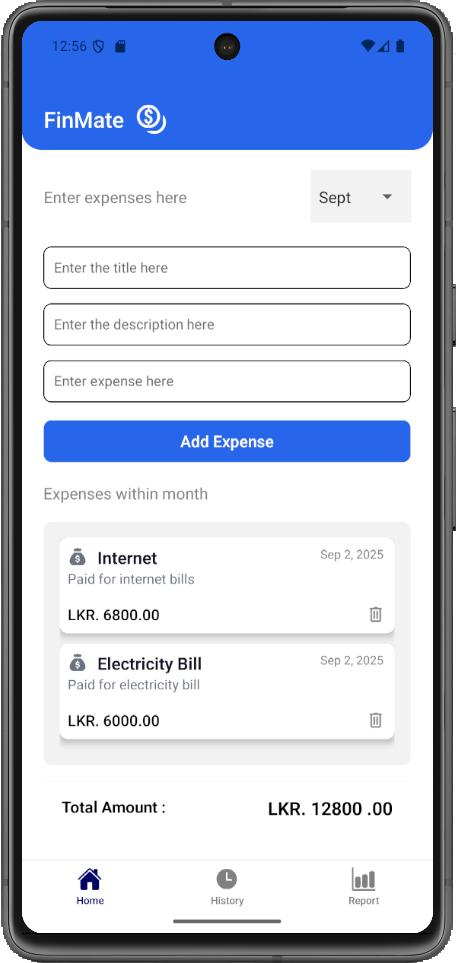
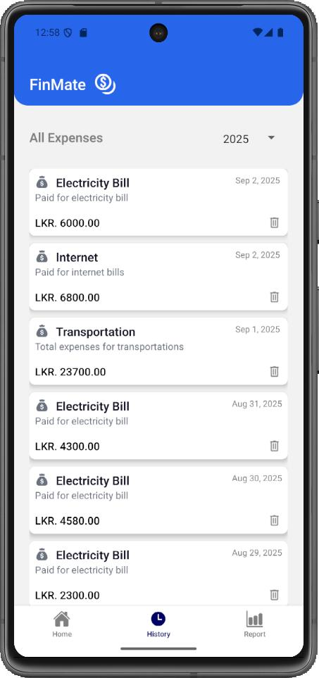
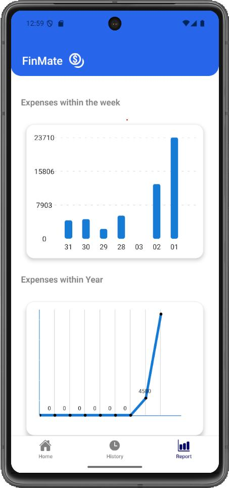

# Expense Tracker 💸📱

**Expense Tracker** is a simple, full-stack mobile application for personal finance management. It allows users to track income and expenses, categorize spending, and view their financial history on the go.

---

## ✨ Key Features & Achievements

- 📱 **Cross-Platform Frontend**: Built with **React Native** and **Expo** for a performant, cross-platform (iOS & Android) app with a clean, intuitive user experience.
- 📋 **Efficient Data Rendering**: Uses `FlatList` for efficient rendering of financial data, `Pickers` for intuitive category selection and date filtering.
- 💾 **Offline Support**: Uses `AsyncStorage` for persistent local caching of user data, enhancing offline functionality and app performance.
- 🔐 **Secure Backend API**: Robust back-end built with **Java** and **Hibernate**, providing secure CRUD operations for user authentication and expense data management.
- 🔗 **Fast Dev Loop**: Used **Ngrok** to create secure tunnels for real-time testing of the locally hosted backend API with the mobile frontend.

---

## 🛠️ Tech Stack

### **Frontend (Mobile)**
- **Framework**: React Native with [Expo](https://expo.dev/)
- **Language**: TypeScript
- **Key Components**: FlatList, Pickers, AsyncStorage

### **Backend**
- **Language**: Java
- **ORM**: Hibernate
- **Tunneling**: Ngrok (for development/testing)

---

## 🚀 Getting Started

### **Prerequisites**

- [Node.js](https://nodejs.org/) (v18.x or higher)
- [Expo Go](https://expo.dev/go) app installed on your physical device **OR** an Android Emulator / iOS Simulator
- [Java Development Kit (JDK 17+)](https://www.oracle.com/java/technologies/downloads/)

### **1. Install dependencies**

```bash
npm install
```

### **2. Configure environment variables**

Create a `.env` file in the project root and point it to your backend:

```env
EXPO_PUBLIC_API_URL=http://<YOUR_LOCAL_IP_OR_NGROK_URL>:8080/expense-tracker/api
```

### **3. Run the app**

Start the Expo development server:

```bash
npx expo start
```

- **Physical Device**: Scan the QR code displayed in the terminal using the **Expo Go** app.
- **Android Emulator**: Press `a` in the terminal.
- **iOS Simulator**: Press `i` in the terminal.

---

## 🖼️ Application Screenshots

<!--
  ADD YOUR SCREENSHOTS HERE.
  Place the image files in a folder (e.g. ./screenshots/) inside the repo root,
  then update the paths below to match your filenames.
-->

| Screen 1 | Screen 2 | Screen 3 |
| :---: | :---: | :---: |
|  |  |  |

<!-- Add more rows/screenshots below as needed, following the same pattern -->

---

## 📜 License

This project is licensed under the [MIT License](LICENSE).
